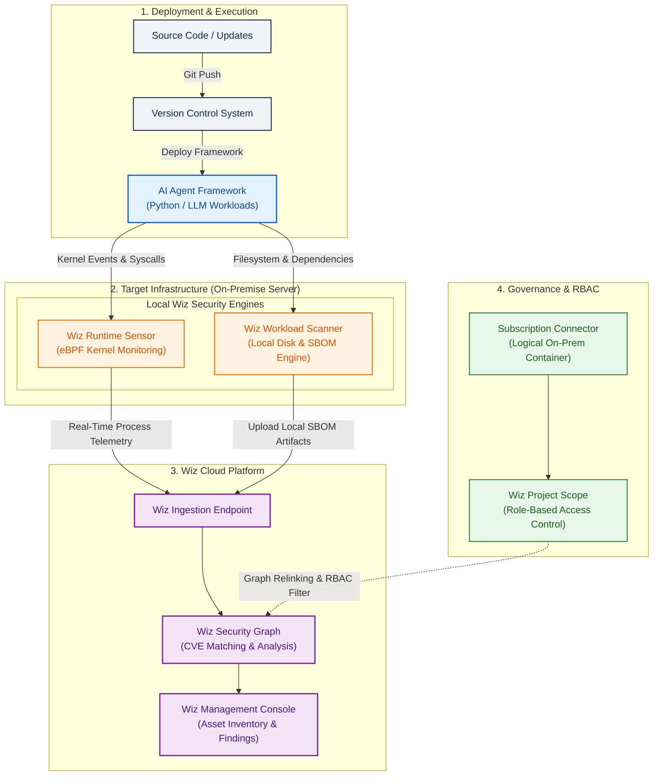

# Hermes Agents x Wiz Cloud Security: On-Prem Infrastructure & Runtime Protection


> **Tags:** `wiz-security` • `hermes-agents` • `ebpf-sensor` • `workload-scanner` • `devsecops` • `ubuntu` • `vulnerability-management`

---

## Goal

This project evaluates the security posture of the **Hermes Agents AI Framework** running on an **On-Premise Ubuntu Linux host (`dev-nvworkb01`)**. 

It documents the deployment, architecture, and real-world onboarding process using:
* **Wiz Runtime Sensor (eBPF-based)** for real-time threat detection and process monitoring.
* **Wiz Workload Scanner (Disk Scanner)** for Software Composition Analysis (SCA) and Software Bill of Materials (SBOM) vulnerability mapping.

---

## Architecture & Resource Hierarchy

Understanding how Wiz models On-Premise infrastructure differs from native public clouds. The mapping follows a three-tier hierarchy:
```text
[ Wiz Project (Scope/RBAC) ]  <-- (1:N / N:1 Mapping)
       │
       └── [ Subscription Connector: dc-muc-vmware ] (Logical Container)
                  │
                  └── [ Native Resource: dev-nvworkb01 ] (Target Host)
                             ├── Runtime Sensor (eBPF Daemon)
                             └── Workload Scanner (Disk/SBOM Engine)
```

### 1. Subscription (`e.g. datacenter`)
* **Role:** The logical container / virtual subscription wrapper.
* **Purpose:** Acts as the technical "envelope" for on-prem environments where no direct cloud provider API (e.g., AWS/Azure) or vCenter API integration is present. It groups physical and virtual servers within the same datacenter scope.

### 2. Resource (`e.g. vm`)
* **Role:** The actual target host running Ubuntu Linux and the Hermes Agents framework.
* **Relationship:** Strict 1:1 mapping (one resource belongs to exactly one subscription container). Both security agents run locally on this host.

### 3. Project Scope (Visibility & Access Control)
* **Role:** A virtual filter / RBAC boundary determining which teams or users can view specific assets.
* **Flexibility:** Subscriptions and their underlying resources can be assigned to one or multiple projects simultaneously.



---

## Installed Wiz Components

Both agents were deployed on `vm` via a unified installation script:

### 1. Wiz Runtime Sensor (eBPF Kernel Protection)
* **Type:** Background daemon leveraging Linux **eBPF** (Extended Berkeley Packet Filter).
* **Capabilities:**
  * **Process Monitoring:** Tracks spawned processes in real time (e.g., shell commands or sub-processes executed dynamically by Hermes Agents).
  * **Network Telemetry:** Monitors open sockets, active outbound connections, and suspicious traffic.
  * **File System Integrity:** Detects unauthorized access to sensitive system files.

### 2. Wiz Workload Scanner (Disk Scanner)
* **Type:** Local file system analysis utility (enabled via `WIZ_ENABLE_DISK_SCANNER=1`).
* **Capabilities:**
  * **SBOM Generation:** Scans local disk paths to inventory OS packages (`dpkg`/`apt`) and application-level libraries (Python `pip` dependencies, Node.js packages, binary files).
  * **Static Vulnerability Assessment:** Uploads the SBOM to the Wiz backend for correlation against global CVE databases to detect vulnerabilities in third-party libraries used by Hermes Agents.

---

## Onboarding & Scoping Workflow (Backend Syncing)

When deploying Wiz sensors on unmanaged On-Premise hosts, data visibility in the Wiz GUI is not instantaneous due to asynchronous batch processing in the Wiz Security Graph.

### Processing Pipeline:

```text
[ Sensor Installation ]
          │
          ▼
[ Data Ingestion (HTTP 200) ]
          │
          ▼
[ Tag & Resource Evaluation ] ──► Matches tags (e.g., Region: <region_value>, owner: <owner_value>)
          │
          ▼
[ Graph Relinking ]          ──► Maps subscription & host to target Wiz Project(s)
          │
          ▼
[ Native Asset Rendering ]   ──► Generates 'Native Host / Server' asset in Project Inventory
          │
          ▼
[ Asynchronous SBOM Processing ]   ──► Correlates local package inventory against global CVE database
          │
          ▼
[ Security Module Activation ]    ──► Unlocks Vulnerability Management tab & RBAC findings
```
## Lessons Learned:
Asynchronous Graph Sync: Scoping rules for new subscriptions or tags are processed in periodic background jobs (Graph-Sync interval). It can take 15 to 60 minutes before uploaded SBOM data is rendered into an active, clickable Native Host asset in the project dashboard.

Asset Type Differentiation: On-Premise hosts connected solely via sensors are categorized as Native Hosts / Servers, rather than traditional Cloud Virtual Machines. Searching for the asset in the Wiz GUI requires filtering for Server or Deployment Group resources.